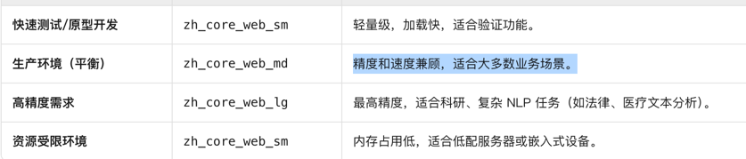

<h1 align="center">大模型部署相关</h1>


## 模型依赖部分
#### 
环境管理使用
```
conda
curl -O https://repo.anaconda.com/miniconda/Miniconda3-latest-Linux-x86_64.sh
bash Miniconda3-latest-Linux-x86_64.sh
conda create -n bert python=3.12
conda activate bert

```

```
conda arm
curl -O https://repo.anaconda.com/miniconda/Miniconda3-latest-Linux-aarch64.sh

bash Miniconda3-latest-Linux-aarch64.sh

source ~/.bashrc


conda create -n bert python=3.12
conda activate bert

```

####
```sh
选择 zh_core_web_md  
https://spacy.io/models/zh#zh_core_web_md 
适合生产环境 
下载预编译 Wheel 文件 使用pip安装 

mkdir zh_core_web_md_offline
cd zh_core_web_md_offline

pip3 download zh_core_web_md==3.8.0  -i https://pypi.tuna.tsinghua.edu.cn/simple

scp 
cd zh_core_web_md_offline
pip3  install --no-index --find-links=. zh_core_web_md-3.8.0-py3-none-any.whl


```



##测试数据
### 智能引擎部分
##### 1. 添加钱学森信息
        kgController.add_document(
            title="钱学森",
            content="""钱学森是中国著名科学家，被誉为"中国航天之父"。1911年生于上海，1935年赴美留学，
                1955年回国效力。他是中国导弹和航天事业的奠基人，两弹一星功勋奖章获得者。""",
            entities=[
                {"name": "钱学森", "type": "科学家"},
                {"name": "中国航天", "type": "科技领域"},
                {"name": "两弹一星", "type": "科技成就"},
                {"name": "美国", "type": "国家"},
                {"name": "上海", "type": "城市"}
            ],
            person_info={
                "name": "钱学森",
                "birth_year": 1911,
                "death_year": 2009,
                "nationality": "中国",
                "achievements": [
                    {"name": "中国导弹之父", "year": 1956},
                    {"name": "两弹一星功勋奖章", "year": 1999}
                ],
                "related_events": [
                    {"name": "回国效力", "year": 1955},
                    {"name": "中国第一颗人造卫星发射", "year": 1970}
                ]
            }
        )

        # 2. 添加袁隆平信息
        kgController.add_document(
            title="袁隆平",
            content="""袁隆平是中国杂交水稻育种专家，被誉为"杂交水稻之父"。1930年生于北京，
                他成功研发出杂交水稻技术，为解决中国粮食问题作出巨大贡献，2004年获世界粮食奖。""",
            entities=[
                {"name": "袁隆平", "type": "农业科学家"},
                {"name": "杂交水稻", "type": "农业科技"},
                {"name": "世界粮食奖", "type": "奖项"},
                {"name": "北京", "type": "城市"}
            ],
            person_info={
                "name": "袁隆平",
                "birth_year": 1930,
                "death_year": 2021,
                "nationality": "中国",
                "achievements": [
                    {"name": "杂交水稻之父", "year": 1970},
                    {"name": "世界粮食奖", "year": 2004}
                ],
                "related_events": [
                    {"name": "杂交水稻研究突破", "year": 1973},
                    {"name": "超级稻亩产突破", "year": 2011}
                ]
            }
        )

        # 3. 添加屠呦呦信息
        kgController.add_document(
            title="屠呦呦",
            content="""屠呦呦是中国药学家，2015年诺贝尔生理学或医学奖获得者。她从中医药古典文献中
                获取灵感，发现了青蒿素，为全球疟疾治疗做出革命性贡献。""",
            entities=[
                {"name": "屠呦呦", "type": "药学家"},
                {"name": "青蒿素", "type": "药物"},
                {"name": "诺贝尔生理学或医学奖", "type": "奖项"},
                {"name": "中医药", "type": "医学体系"}
            ],
            person_info={
                "name": "屠呦呦",
                "birth_year": 1930,
                "death_year": None,
                "nationality": "中国",
                "achievements": [
                    {"name": "诺贝尔生理学或医学奖", "year": 2015},
                    {"name": "青蒿素发现者", "year": 1972}
                ],
                "related_events": [
                    {"name": "青蒿素临床试验", "year": 1972},
                    {"name": "诺贝尔奖颁奖", "year": 2015}
                ]
            }
        )

        # 4. 添加马云信息
        kgController.add_document(
            title="马云",
            content="""马云是中国企业家，阿里巴巴集团创始人。1964年生于浙江杭州，1999年创立阿里巴巴，
                推动了中国电子商务的发展，2014年阿里巴巴在纽交所上市，创下当时全球最大IPO记录。""",
            entities=[
                {"name": "马云", "type": "企业家"},
                {"name": "阿里巴巴", "type": "公司"},
                {"name": "电子商务", "type": "产业"},
                {"name": "浙江杭州", "type": "城市"}
            ],
            person_info={
                "name": "马云",
                "birth_year": 1964,
                "death_year": None,
                "nationality": "中国",
                "achievements": [
                    {"name": "阿里巴巴创始人", "year": 1999},
                    {"name": "全球最大IPO记录", "year": 2014}
                ],
                "related_events": [
                    {"name": "阿里巴巴创立", "year": 1999},
                    {"name": "阿里巴巴纽交所上市", "year": 2014}
                ]
            }
        )
    kgController.add_document(
            title="鲁迅",
            content="""鲁迅是中国著名文学家、思想家、革命家、教育家、民主战士，新文化运动的重要参与者，中国现代文学的奠基人之一。1881年生于浙江绍兴，原名周树人，"鲁迅"是他1918年发表《狂人日记》时所用的笔名。他以笔为武器，深刻批判封建礼教和社会弊病，创作了《呐喊》《彷徨》《朝花夕拾》等经典作品，对中国现代文学发展产生深远影响。1936年病逝于上海。""",
            entities=[
                {"name": "鲁迅", "type": "文学家"},
                {"name": "周树人", "type": "本名"},
                {"name": "狂人日记", "type": "文学作品"},
                {"name": "呐喊", "type": "文学作品"},
                {"name": "彷徨", "type": "文学作品"},
                {"name": "朝花夕拾", "type": "文学作品"},
                {"name": "新文化运动", "type": "历史运动"},
                {"name": "浙江绍兴", "type": "出生地"},
                {"name": "上海", "type": "逝世地"}
            ],
            person_info={
                "name": "鲁迅",
                "birth_year": 1881,
                "death_year": 1936,
                "nationality": "中国",
                "achievements": [
                    {"name": "新文化运动先驱", "year": 1915},
                    {"name": "《狂人日记》发表", "year": 1918},
                    {"name": "《呐喊》出版", "year": 1923},
                    {"name": "《彷徨》出版", "year": 1926},
                    {"name": "《朝花夕拾》出版", "year": 1928}
                ],
                "related_events": [
                    {"name": "赴日学医", "year": 1902},
                    {"name": "弃医从文", "year": 1906},
                    {"name": "发表《狂人日记》", "year": 1918},
                    {"name": "参与新文化运动", "year": 1915},
                    {"name": "逝世于上海", "year": 1936}
                ]
            }
        )

>中国科学家有哪些\
中国科学家奖项有哪些\
杂交水稻之父是谁\  头衔查询
谁发明了青蒿素\
袁隆平\
阿里巴巴集团创始人


### 情感分析模块
```sh
基于关系映射的关系情感分析评价，类似
"analyzer": {
            "sentiment": "negative",
            "confidence": 0.85,
            "explanation": "政治敏感关系"
        }
```
### 智能问答
基于实体，关系，属性提供的用户提问nlp向量分割，neo4j查询和语义转换回答

## 知识融合

本体对齐
对齐不同本体中的概念/实体（建立映射关系）
两个或多个独立的本体（Ontology）
本体A的概念 ↔ 本体B的概念 的映射关系
解决“不同本体中的相似概念如何对应”
- 多源数据集成
- 跨语言本体融合
- 知识融合


实体链接
将文本中的提及（mention）链接到知识库中的具体实体
自然语言文本 + 知识库
文本中的提及 → 知识库实体ID
解决“这个提及指代哪个已知实体”
- 文本知识图谱构建
- 搜索引擎实体消歧
- QA系统


## 纠错和补全实现
### 纠错实现
>    "question": "少先队员因该为老人让坐"
>    "target": "少先队员应该为老人让座",


尝试 chinese-text-correction-1.5b LLM GPT QWEN 大模型，加载速度约15-50s 

切换到 kenlm + pycorrector
首次调用correct()时：

自动下载语言模型（约2.9GB的zh_giga.klm）到 ~/.pycorrector/datasets/

离线环境预部署方案
wget -P ~/.pycorrector/datasets/ https://deepspeech.bj.bcebos.com/zh_lm/zh_giga.no_cna_cmn.prune01244.klm

### 补全实现
chinese-text-correction-1.5b  选择大模型实现，其余方案补全效果太差。
> 我今天去公园玩了 -     
> "corrected_text": "我今天去公园玩了，回来就肚子疼，拉肚子"


### model迁移部署步骤 docker
1 scp -r app/pretrained_models ssh root@120.46.95.250:/root/


conda打包迁移 

