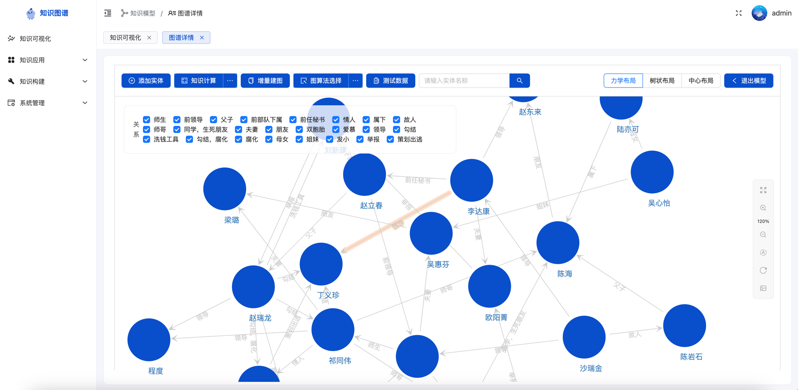

# Fast Relation


> fastapi 的知识图谱项目，提供从多数据源的，人物识别关系抽取的知识图谱构建


<p>
  <a href="https://www.python.org/"></a>
  <a href="https://fastapi.tiangolo.com/"></a>
  <a href="https://www.docker.com/"></a>
  <a href="LICENSE"></a>
</p>



后端流程：
- 导入docker镜像
- 解压`vue-fastapi-admin.tar.gz`
- 修改Docker配置文件
- 配置达梦数据库连接
- 执行 SQL
- 配置Docker网络
- 赋予文件写入权限
- 启动容器


# 导入docker镜像

```bash
# 导入镜像
docker load -i neo4j_es_kafka_zk.tar.gz
docker load -i backend_web.tar.gz
```

# 解压`vue-fastapi-admin.tar.gz`

```bash
# 1. 解压到指定目录，需提前创建目录
# 如目标目录为`/home/projects`
mkdir -p /home/projects
tar -zxvf vue-fastapi-admin.tar.gz -C /home/projects
# 或者解压文件到当前目录
tar -zxvf vue-fastapi-admin.tar.gz
# 2. klm 文件拷贝到项目目录下
zh_giga.no_cna_cmn.prune01244.klm 
copy  zh_giga.no_cna_cmn.prune01244.klm  /vue-fastapi-admin/zh_giga.no_cna_cmn.prune01244.klm
# 3. saved_models.zip 解压
cd /vue-fastapi-admin/app/utils
unzip saved_models.zip
# 4. pretrained_models.zip 解压
cd /vue-fastapi-admin/app
unzip pretrained_models.zip


```

# 修改Docker配置文件

首先进入到`vue-fastapi-admin`目录

## 自动修改

```bash
# 给予执行权限
chmod +x ./update_docker_env.sh
# 执行
./update_docker_env.sh
# 查看docker env配置文件是否和当前vue-fastapi-admin目录一致
# 查看当前工作目录
pwd
# 查看配置文件，第二行根路径`PROJECT_ROOT`是否和当前工作目录一致
cat ./conf.d/docker/.env
```

！！！如果不一致，需要手动修改

1. 进入项目`vue-fastapi-admin`目录后，通过`pwd`命令查看当前工作目录
```bash
# 查看当前工作目录，如：/home/projects/vue-fastapi-admin
  pwd
```
2. 进入`./conf.d/docker`目录，修改`.env`配置文件，将`PROJECT_ROOT`变量替换为当前工作目录
```text
# 将根路径替换为你pwd命令查看到的工作目录，如：
PROJECT_ROOT=/home/projects/vue-fastapi-admin
```

# 配置达梦数据库连接

修改项目目录`vue-fastapi-admin`下`.env.prod` 文件，将`# DM Database` 后的连接信息替换为客户的
注：DM_DATABASE 也就是达梦数据库的 schema 名称


# 执行 SQL：

SQL 脚本位于`conf.d/sql`，根据实际的 schema 名称（也就是 DM_DATABASE 名称）替换，到可连接到达梦数据库的环境中执行，看注释，建表和插入数据分开执行


# 配置Docker网络：

```bash
docker network create kg-network
```


# 赋予文件夹的权限

- 以下需要在项目`vue-fastapi-admin`目录内执行

首先查看当前目录下是否有`data`文件夹

```bash
 ls | grep data
```

- 赋予权限

```bash

chmod -R a+rwx ./data/neo4j
chmod -R a+rwx ./data/elasticsearch
chmod -R a+rwx ./data/zookeeper
chmod -R a+rwx ./data/kafka
chmod -R a+rwx ./data/nginx
chmod -R a+rwx ./dist

```

# 启动容器

- 前提：镜像已复制到 docker 中
- 以下需要在项目`vue-fastapi-admin`目录内执行

启动：

```bash
docker-compose --env-file conf.d/docker/.env -f conf.d/docker/Docker-compose.yml up -d
# 等待30秒左右，等所有服务启动，再执行
docker-compose --env-file conf.d/docker/.env -f conf.d/docker/Docker-compose-kg.yml up -d
```

停止：

```bash
docker-compose --env-file conf.d/docker/.env -f conf.d/docker/Docker-compose.yml down
docker-compose --env-file conf.d/docker/.env -f conf.d/docker/Docker-compose-kg.yml down
```


